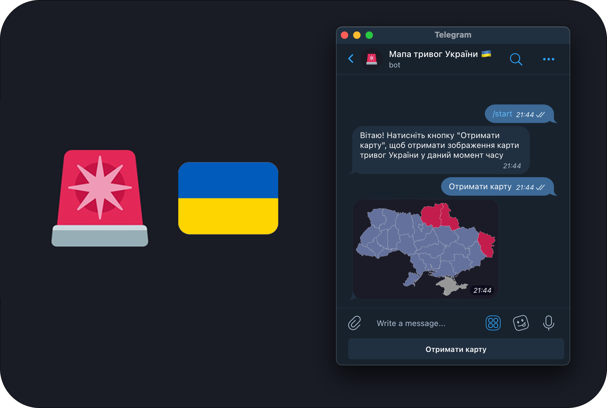

# Alerts UA Bot 🇺🇦

A simple telegram bot that fetches alert map on user request



As a source of information bot uses [Air Raid Alert API (Ukraine, UNOFFICIAL](https://alerts.com.ua/en)

This Project uses telegram bot library [grammY](https://grammy.dev), which is technicle a fork of more popular telegraf.js library, but have better tooling and typescript support.

## Running

```bash
npm install
npm run build
npm run start
```
